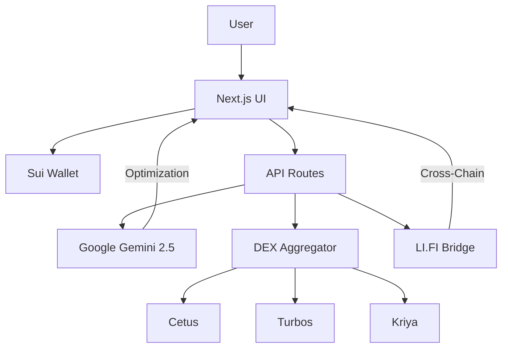

# SuiFlow: AI-Powered DEX Aggregator for Sui

<div align="center">
  
  <h3>Intelligent Swaps, Optimal Routes, Cross-Chain Bridge</h3>
  <p>Powered by Google Gemini 2.5 Flash & LI.FI</p>

  [Demo](https://suiflow.app) • [Discord](https://discord.gg/suiflow) • [Docs](https://docs.suiflow.app)
</div>

---

## 🚀 Overview

SuiFlow is the first **AI-powered DEX aggregator** on the Sui blockchain. Instead of relying solely on static algorithms, SuiFlow uses **Google Gemini 2.5 Flash** to analyze liquidity pools across multiple DEXs (Cetus, Turbos, Kriya) in real-time, considering slippage, fees, gas costs, and market volatility to recommend the absolute best swap route.

It also features a seamless **cross-chain bridge** powered by LI.FI, allowing users to move assets from Ethereum, Polygon, and Arbitrum directly to Sui in a single click.

## ✨ Key Features

- **🤖 AI Route Optimization**: Google Gemini 2.5 Flash analyzes liquidity depth and volatility to find routes that static aggregators miss.
- **💧 Multi-DEX Aggregation**: Integrates Cetus, Turbos, and Kriya for maximum liquidity.
- **🌉 Cross-Chain Bridge**: One-click bridging from EVM chains to Sui via LI.FI.
- **🏷️ ENS Integration**: Displays human-readable names (e.g., `usdc.eth`, `vitalik.eth`) for better UX.
- **⚡ Lightning Fast**: Built on Next.js 14 and Sui's high-speed network.

## 🛠️ Tech Stack

- **Frontend**: Next.js 14, TypeScript, Tailwind CSS
- **AI Engine**: Google Gemini 2.5 Flash (`@google/generative-ai`)
- **Blockchain**: Sui Mainnet (`@mysten/sui`, `@mysten/dapp-kit`)
- **Cross-Chain**: LI.FI SDK (`@lifi/sdk`)
- **Identity**: ENS (`viem`)

## 📦 Installation

1. **Clone the repository**
   ```bash
   git clone https://github.com/your-username/suiflow.git
   cd suiflow
   ```

2. **Install dependencies**
   ```bash
   npm install
   ```

3. **Set up environment variables**
   Create a `.env.local` file with the following keys:
   ```bash
   # Google Gemini API (for AI routing)
   GOOGLE_AI_API_KEY=your_gemini_key

   # LI.FI API (for cross-chain)
   LIFI_API_KEY=your_lifi_key

   # Alchemy/Infura (for ENS resolution)
   NEXT_PUBLIC_ALCHEMY_KEY=your_alchemy_key
   ```

4. **Run the development server**
   ```bash
   npm run dev
   ```

5. **Open in browser**
   Visit `http://localhost:3000` to see the app.

## 🏗️ Architecture



## 🧪 Testing

Run the test suite to verify routing logic and API integrations:

```bash
# Run unit tests
npm test

# Run linting
npm run lint
```

## 📜 License

MIT License. See [LICENSE](LICENSE) for details.

## 🙏 Acknowledgements

- **Sui Foundation** for the amazing blockchain infrastructure.
- **Google Cloud** for the Gemini AI model.
- **LI.FI** for the cross-chain SDK.
- **ENS** for the identity layer.